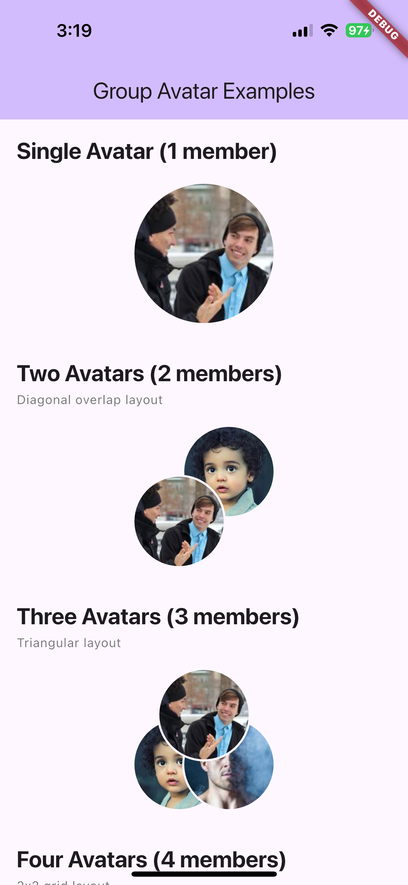
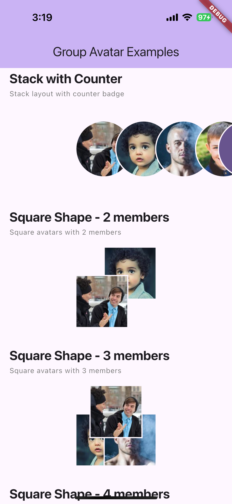
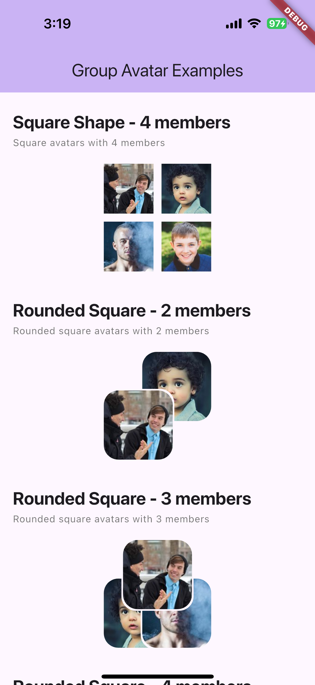
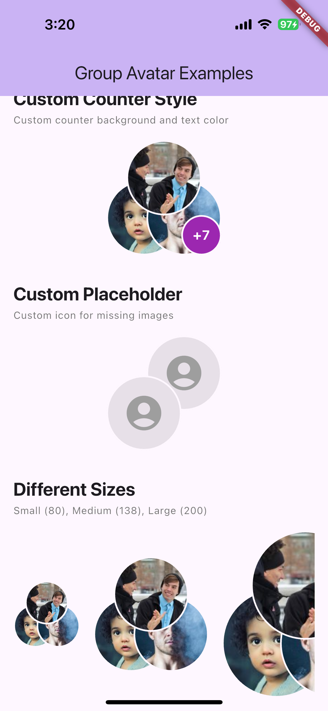
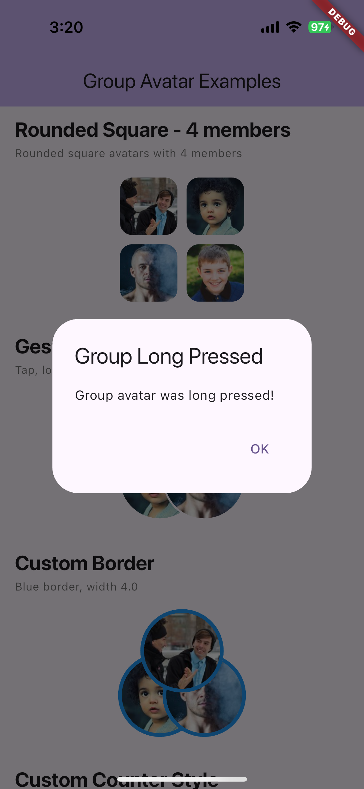
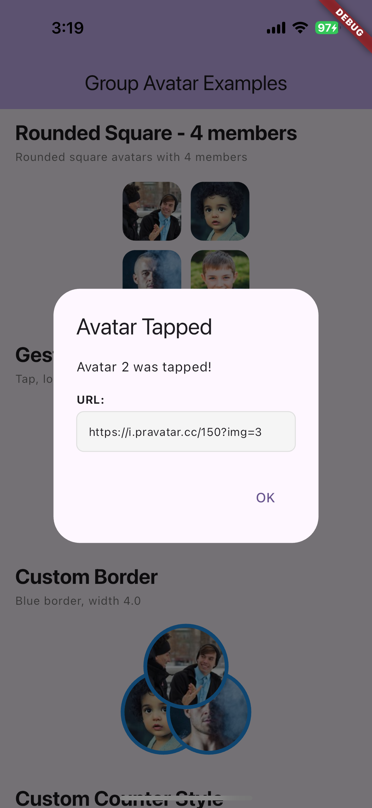

# Group Avatar

A Flutter package for displaying group chat avatars with adaptive overlapping layouts. Perfect for chat applications like KakaoTalk, WhatsApp, and Telegram.

## Features

- 🎨 **Adaptive Layout**: Automatically adjusts layout based on member count
  - **1 member**: Single circle avatar
  - **2 members**: Two diagonal overlapped circles (top-right & bottom-left)
  - **3 members**: Triangular pattern (top-center, bottom-left, bottom-right)
  - **4+ members**: 2x2 grid layout (shows first 4 members)
  - **Stack layout**: Horizontal overlapping layout (left to right)
- 🖼️ **Cached Network Images**: Uses `cached_network_image` for efficient image loading
- 🎯 **Customizable**: Size, border color, border width, placeholder icon, and avatar shape
- 🎭 **Placeholder Support**: Shows placeholder icons for missing or failed images
- 📱 **Theme Aware**: Automatically adapts to your app's theme
- 🔢 **Counter Badge**: Show remaining member count with "+N" badge
- 👆 **Gesture Support**: Tap, long press, and individual avatar tap callbacks
- 🔲 **Multiple Shapes**: Circle, square, rounded square, and stack layouts

## Installation

Add this to your package's `pubspec.yaml` file:

```yaml
dependencies:
  chat_group_avatar: ^0.0.1
```

Then run:

```bash
flutter pub get
```

## Usage

### Basic Usage

```dart
import 'package:chat_group_avatar/group_avatar.dart';

GroupAvatar(
  imageUrls: [
    'https://example.com/avatar1.jpg',
    'https://example.com/avatar2.jpg',
    'https://example.com/avatar3.jpg',
  ],
  size: 138,
)
```

### With Customization

```dart
GroupAvatar(
  imageUrls: [
    'https://example.com/avatar1.jpg',
    'https://example.com/avatar2.jpg',
  ],
  size: 100,
  borderColor: Colors.blue,
  borderWidth: 3.0,
  backgroundColor: Colors.grey[200],
  placeholderIcon: Icon(Icons.account_circle),
)
```

### Different Member Counts

```dart
// Single member
GroupAvatar(
  imageUrls: ['https://example.com/avatar1.jpg'],
  size: 138,
)

// Two members (diagonal overlap)
GroupAvatar(
  imageUrls: [
    'https://example.com/avatar1.jpg',
    'https://example.com/avatar2.jpg',
  ],
  size: 138,
)

// Three members (triangular)
GroupAvatar(
  imageUrls: [
    'https://example.com/avatar1.jpg',
    'https://example.com/avatar2.jpg',
    'https://example.com/avatar3.jpg',
  ],
  size: 138,
)

// Four or more members (2x2 grid)
GroupAvatar(
  imageUrls: [
    'https://example.com/avatar1.jpg',
    'https://example.com/avatar2.jpg',
    'https://example.com/avatar3.jpg',
    'https://example.com/avatar4.jpg',
    'https://example.com/avatar5.jpg', // Only first 4 are shown
  ],
  size: 138,
)

// With counter badge (show +N for remaining members)
GroupAvatar(
  imageUrls: List.generate(10, (i) => 'https://example.com/avatar$i.jpg'),
  size: 138,
  maxVisible: 3,
  showCounter: true,
)

// Stack layout (horizontal overlapping)
GroupAvatar(
  imageUrls: [
    'https://example.com/avatar1.jpg',
    'https://example.com/avatar2.jpg',
    'https://example.com/avatar3.jpg',
  ],
  size: 138,
  shape: AvatarShape.stack,
  showCounter: true,
)

// With gesture callbacks
GroupAvatar(
  imageUrls: [
    'https://example.com/avatar1.jpg',
    'https://example.com/avatar2.jpg',
  ],
  size: 138,
  onTap: () => print('Group tapped'),
  onLongPress: () => print('Group long pressed'),
  onAvatarTap: (index, url) => print('Avatar $index tapped: $url'),
)

// Different shapes
GroupAvatar(
  imageUrls: ['https://example.com/avatar1.jpg'],
  size: 138,
  shape: AvatarShape.square, // or roundedSquare, stack
)
```

## Parameters

| Parameter                | Type                                     | Default              | Description                                                               |
| ------------------------ | ---------------------------------------- | -------------------- | ------------------------------------------------------------------------- |
| `imageUrls`              | `List<String?>`                          | **required**         | List of image URLs to display                                             |
| `size`                   | `double`                                 | `138`                | Size of the bounding box                                                  |
| `borderColor`            | `Color?`                                 | `null`               | Border color (defaults to theme's surface color)                          |
| `borderWidth`            | `double`                                 | `2.0`                | Border width                                                              |
| `placeholderIcon`        | `Widget?`                                | `null`               | Custom placeholder icon (defaults to `Icons.person`)                      |
| `backgroundColor`        | `Color?`                                 | `null`               | Background color for avatars (defaults to theme's surface color)          |
| `shape`                  | `AvatarShape`                            | `AvatarShape.circle` | Avatar shape: `circle`, `square`, `roundedSquare`, or `stack`             |
| `maxVisible`             | `int?`                                   | `null`               | Maximum number of avatars to display (default: 4 for grid, all for stack) |
| `showCounter`            | `bool`                                   | `false`              | Show counter badge for remaining members                                  |
| `counterStyle`           | `TextStyle?`                             | `null`               | Style for the counter text                                                |
| `counterBackgroundColor` | `Color?`                                 | `null`               | Background color for the counter badge                                    |
| `onTap`                  | `VoidCallback?`                          | `null`               | Callback when the group avatar is tapped                                  |
| `onLongPress`            | `VoidCallback?`                          | `null`               | Callback when the group avatar is long pressed                            |
| `onAvatarTap`            | `void Function(int index, String? url)?` | `null`               | Callback when an individual avatar is tapped                              |

## Layout Details

### Single Avatar (1 member)

- Displays a single circular avatar at full size

### Two Avatars (2 members)

- Two avatars arranged diagonally
- Bottom-left avatar appears on top
- Top-right avatar appears underneath
- Each avatar is 90/138 of the total size

### Three Avatars (3 members)

- Triangular arrangement
- Top-center, bottom-left, bottom-right positions
- Each avatar is 90/138 of the total size

### Four or More Avatars (4+ members)

- 2x2 grid layout
- No overlap between avatars
- Only the first 4 avatars are displayed (or `maxVisible` if specified)
- Each cell is 66/138 of the total size

### Stack Layout

- Horizontal overlapping layout (left to right)
- Avatars overlap by 30% of their size
- Useful for member lists or horizontal displays
- Can show counter badge for remaining members

### Counter Badge

- Shows "+N" badge when `showCounter` is true and there are more members than `maxVisible`
- Positioned at bottom-right (or right for stack layout)
- Customizable style and background color

## Example

See the `example/` directory for a complete example app.

## Screenshots

### Basic Layouts

<div style="display: flex; flex-wrap: wrap; gap: 10px;">
  
  
  
  
</div>

### Counter Badge & Stack Layout

<div style="display: flex; flex-wrap: wrap; gap: 10px;">
  
  
  
</div>

### Different Shapes

<div style="display: flex; flex-wrap: wrap; gap: 10px;">
  
  
  
  
  
  
</div>

### Customization Options

<div style="display: flex; flex-wrap: wrap; gap: 10px;">
  
  
  
  
</div>

### Gesture Events

<div style="display: flex; flex-wrap: wrap; gap: 10px;">
  
  
  
</div>

## Contributing

Contributions are welcome! Please feel free to submit a Pull Request.

## License

This project is licensed under the MIT License - see the [LICENSE](LICENSE) file for details.

## Related Packages

- [avatar_stack](https://pub.dev/packages/avatar_stack) - Horizontal overlapping avatars
- [cached_network_image](https://pub.dev/packages/cached_network_image) - Image caching (used internally)

## Support

If you encounter any issues or have feature requests, please file an issue on the [GitHub repository](https://github.com/yourusername/chat_group_avatar).
